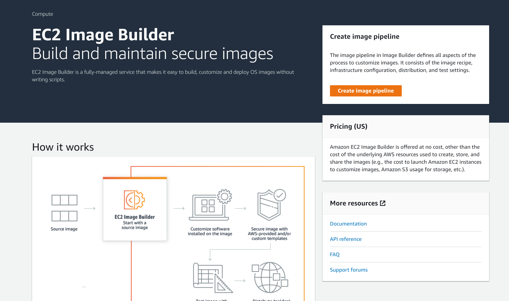
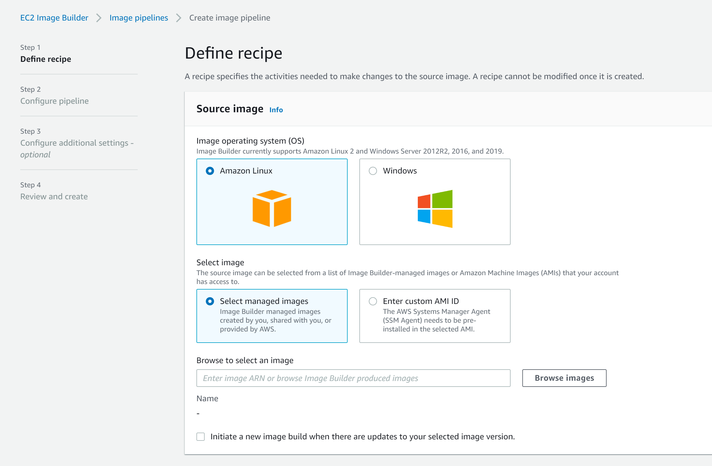
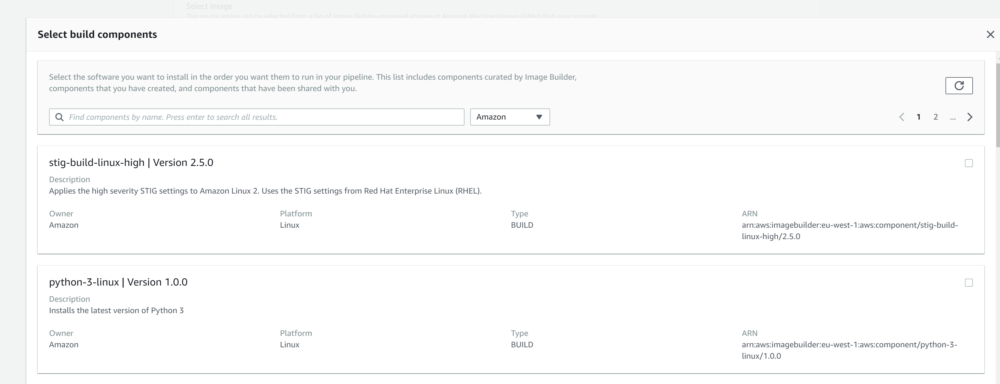
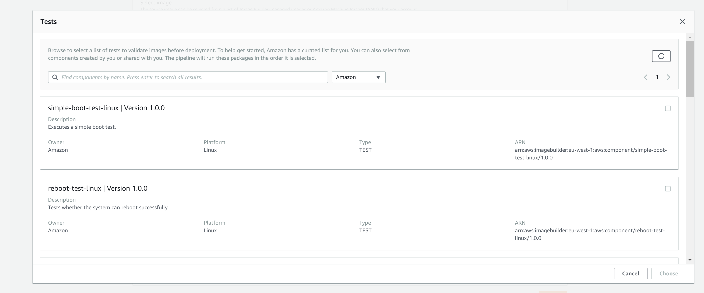
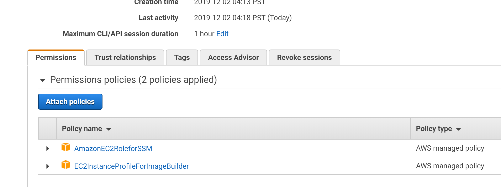
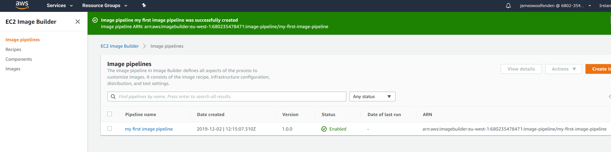
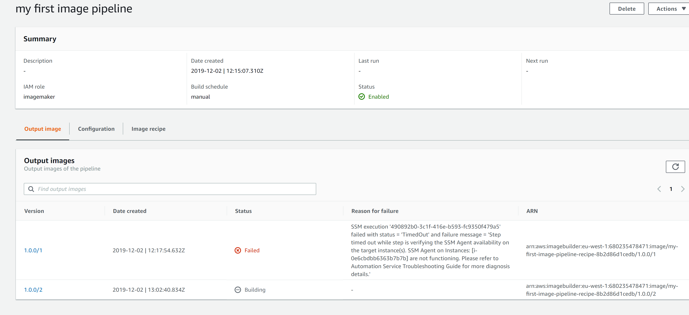

# The New AWS Imagebuilder

AWS Imagebuilder was announced and released Globally at 2019's Re:invent.
<https://aws.amazon.com/about-aws/whats-new/2019/12/introducing-ec2-image-builder>

There is now a new section in the AWS console UI, which looks initially like:



Once you click create or edit an existing pipeline:


There is a triggers option, if you enable this it will run this pipeline on the release of new base image, which will prove handy for patches.

This will Initiate a new image build when there are updates to your selected base image version.

Support for Amazon Linux and WIndows Server is built in, but to build for other OS/images you'll need to add the SSM service to your base AMI.

The other 2 main part are the support for build **components** and **tests**, think **Provisioners** if you like.

## Build components

You can browse to, or add your own or use others published components



- or click to **create build component**

This launches a UI, there is an included example to get you started:

```YAML
name: HelloWorldTestingDocument
description: This is hello world testing document.
schemaVersion: 1.0

phases:
  - name: build
    steps:
      - name: HelloWorldStep
        action: ExecuteBash
        inputs:
          commands:
            - echo "Hello World! Build."

  - name: validate
    steps:
      - name: HelloWorldStep
        action: ExecuteBash
        inputs:
          commands:
            - echo "Hello World! Validate."

  - name: test
    steps:
      - name: HelloWorldStep
        action: ExecuteBash
        inputs:
          commands:
            - echo "Hello World! Test."
```

There are already a number of defined build components and adding your own bash or ps1 files looks straight forward.

!!! Questions
    
    - Can I or how do I reference Ansible playbooks
    
    - Git repo for components updates and modifications
    At the moment you upload all you related files to S3, I would have though a git repo with associated triggers would be good. 
    - YAML component The syntax for was the component support


## Tests

You can create, browse your own or add others pre-built test components as well



The support for built in tests looks promising.

- Click create test

And again we get a sample populated to clue us in.

```YAML
name: HelloWorldTestingDocument
description: This is hello world testing document.
schemaVersion: 1.0

phases:
  - name: test
    steps:
      - name: HelloWorldStep
        action: ExecuteBash
        inputs:
          commands:
            - echo "Hello World! Test."

```

There's a skeleton example included here.

## Pipeline

With a component added you also need to have an IAM role for the pipeline, I added 2 managed polices but you may want to trim excess permissions:



### IAM Permissions

With a role added you now have a minimal imagebuilder pipeline you can run.



### Invoke and wait

You can them manually invoke.

There is no log output so don't get to see the output as it runs from the UI, they went for a wait and see approach.



As you can see it looks a lot like codebuild, however it does support versioned artefacts for your AMIS which is great to see.
Hopefully it will easy to pick up the versions for use with launching instances.

!!! Questions
    How does this integrate with Amazon Inspector?
    
    Why do we now have 2 different build pipelines, with this and AWS Codepipeline.

## Running from the cli
 
<https://docs.aws.amazon.com/imagebuilder/latest/userguide/managing-image-builder-cli.html>