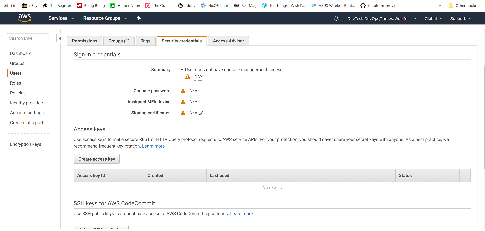

# Building Amazon Machine Images (AMIs) with Packer

This is most likely why you are interested in Packer, you can use Packer to help
make your AMI'S, or what used to be called "Golden Images".
The examples in this chapter target the customization of existing AWS AMI's, usually from AWS or from
trusted sources such as from Canonical (Makers of Ubuntu) which are provided to
your from their AWS account.

You can also build your AMI's from scratch by extending the builders in Packer
ISO chapter, but if theres a choice of not having to deal with answer files or
installers I would, but you may want/have to.

## Amazon Builders

There are a number builders associated with AWS:

- amazon-ebs

- amazon-chroot

- amazon-ebssurrogate

- amazon-ebsvolume

- amazon-instance

That might sound complicated, but 99% of the time it's amazon-ebs.

The first step is to set-up the Authentication.

## Basic AWS Authentication

To use AWS with Packer you will need to set up your AWS authentication. You will
need to have installed the AWS Command Line Interface CLI and obtained your
credentials from the AWS console.



Access Keys

Click to create the keys, you will need to store these credentials safely, they
are only available at creation time and if exposed can lead to significant
financial loss.

## Running and configuring the AWS CLI

Once installed, You will need to set-up and configured your AWS cli with your
credentials, start by calling **aws configure** with the credentials you
obtained previously from AWS console:

```cli
aws configure
Access Key ID [****************]:
AWS Secret Access Key [****************]:
Default region name [eu-west-1]:
Default output format [json]:
```

A simple and short test of AWS connectivity is do a list of S3 buckets:

```cli
aws s3 ls
```

It should return a list of S3 buckets, if you have made any yet that is.

### Using the credentials

Create the file **basic-auth.json**

```packer
{
    "builders": [
        {
            "type": "amazon-ebs",
            "access_key": "",
            "secret_key": "",
            "region": "eu-west-1",
            "source_ami_filter": {
                "filters": {
                    "virtualization-type": "hvm",
                    "name": "ubuntu/images/*ubuntu-xenial-16.04-amd64-server-*",
                    "root-device-type": "ebs"
                },
                "owners": [
                    "099720109477"
                ],
                "most_recent": true
            },
            "instance_type": "t2.micro",
            "ssh_username": "ubuntu",
            "ami_name": "packer-example {{timestamp}}"
        }
    ]
}
```

And try building an AMI, you should see this:

```packer
$ packer build  basic-auth.json
amazon-ebs output will be in this color.

==> amazon-ebs: Prevalidating AMI Name...
    amazon-ebs: Found Image ID: ami-01bc69b830b49f729
==> amazon-ebs: Creating temporary keypair: packer_5c94a9bd-2813-e694-e8a7-8e919e36c874
==> amazon-ebs: Creating temporary security group for this instance: packer_5c94a9c0-710d-8fa9-cc5e-0b36ec553658
==> amazon-ebs: Authorizing access to port 22 on the temporary security group...
==> amazon-ebs: Launching a source AWS instance...
    amazon-ebs: Instance ID: i-05f5aee5f989a0685
==> amazon-ebs: Waiting for instance (i-05f5aee5f989a0685) to become ready...
==> amazon-ebs: Adding tags to source instance
    amazon-ebs: Adding tag: "Name": "Packer Builder"
==> amazon-ebs: Waiting for SSH to become available...
==> amazon-ebs: Connected to SSH!
==> amazon-ebs: Stopping the source instance...
    amazon-ebs: Stopping instance, attempt 1
==> amazon-ebs: Waiting for the instance to stop...
==> amazon-ebs: Creating the AMI: packer-example 1553246653
    amazon-ebs: AMI: ami-069e0a0248ffbba5b
==> amazon-ebs: Waiting for AMI to become ready...
==> amazon-ebs: Terminating the source AWS instance...
==> amazon-ebs: Cleaning up any extra volumes...
==> amazon-ebs: No volumes to clean up, skipping
==> amazon-ebs: Deleting temporary security group...
==> amazon-ebs: Deleting temporary keypair...
Build 'amazon-ebs' finished.

==> Builds finished. The artifacts of successful builds are:
--> amazon-ebs: AMIs were created:

eu-west-1: ami-069e0a0248ffbba5b
```

A number of things are assumed when you run this template, and I am fully aware
that your proscribed AWS set-up and Network environment may not be so liberal
and regular.

### You have require IAM permissions to create EBS volumes, snapshot and to create AMIS

It's not best practice to use an admin or root account. In fact you should have
failed in the last step due to insufficient privileges.

A better way is to create just the permission you need, for a role, by creating
a Packer role and inline policy in AWS. This role is describe in Terraform here
as 2 files, in your terraform IAM project **aws_iam_role_policy.packer.tf**.

```terraform
resource aws_iam_role_policy packer {
    name="packer"
    role = aws_iam_role.packer.id
    policy=<<POLICY
{
  "Version": "2012-10-17",
  "Statement": [{
      "Effect": "Allow",
      "Action" : [
        "ec2:AttachVolume",
        "ec2:AuthorizeSecurityGroupIngress",
        "ec2:CopyImage",
        "ec2:CreateImage",
        "ec2:CreateKeypair",
        "ec2:CreateSecurityGroup",
        "ec2:CreateSnapshot",
        "ec2:CreateTags",
        "ec2:CreateVolume",
        "ec2:DeleteKeyPair",
        "ec2:DeleteSecurityGroup",
        "ec2:DeleteSnapshot",
        "ec2:DeleteVolume",
        "ec2:DeregisterImage",
        "ec2:DescribeImageAttribute",
        "ec2:DescribeImages",
        "ec2:DescribeInstances",
        "ec2:DescribeInstanceStatus",
        "ec2:DescribeRegions",
        "ec2:DescribeSecurityGroups",
        "ec2:DescribeSnapshots",
        "ec2:DescribeSubnets",
        "ec2:DescribeTags",
        "ec2:DescribeVolumes",
        "ec2:DetachVolume",
        "ec2:GetPasswordData",
        "ec2:ModifyImageAttribute",
        "ec2:ModifyInstanceAttribute",
        "ec2:ModifySnapshotAttribute",
        "ec2:RegisterImage",
        "ec2:RunInstances",
        "ec2:StopInstances",
        "ec2:TerminateInstances"
      ],
      "Resource" : "*"
  }]
}POLICY
}
```

And **aws_iam_role.packer.tf**

```terraform
resource aws_iam_role packer {
    name="packer"
    assume_role_policy=<<POLICY
{
  "Version": "2012-10-17",
  "Statement": [
    {
      "Action": "sts:AssumeRole",
      "Principal": {
        "Service": "ec2.amazonaws.com"
      },
      "Effect": "Allow",
      "Sid": ""
    }
  ]
}
POLICY
}
```

You can attach the role "packer" to your user or group.

### That you are not restricted from using port 22 for ssh

A not uncommon policy that some Enterprise IT administrators have, is a policy
of denying ingress and egress on Port 22. Maybe not a policy I agree with, a
solution is still required, fortunately you can use the packer **user_data** and
package the change to the ssh port. The easiest way to update our packer
template, is to use and specify a **user_data_file**, which should like like:

```bash
echo 'port 2222' >> /etc/ssh/sshd_config
service sshd restart
```

Useful protection for Hackers unable to use a Port scanner.

### That you have still have the default Virtual Private Cloud (VPC) and Subnets set up

The previous example did specify where to make the ec2 instance that is used to
make the new AMI and yet somehow it worked? It used the "Default" VPC that comes
with a new account or used the one you have specified as the default. This
probably wont be the case.

You can avoid hard-coding having to pass your VPC and Subnets by using filters
in your template. They follow the same filter patterns as the CLI
<https://docs.aws.amazon.com/AWSEC2/latest/APIReference/API_DescribeSubnets.html>.

Make **basic-auth.dynamicvpc.json**

```packer
{
    "builders": [
        {
            "type": "amazon-ebs",
            "access_key": "",
            "secret_key": "",
            "region": "eu-west-1",
            "source_ami_filter": {
                "filters": {
                    "virtualization-type": "hvm",
                    "name": "ubuntu/images/*ubuntu-xenial-16.04-amd64-server-*",
                    "root-device-type": "ebs"
                },
                "owners": [
                    "099720109477"
                ],
                "most_recent": true
            },
            "instance_type": "t2.micro",
            "ssh_username": "ubuntu",
            "ami_name": "packer-example {{timestamp}}",
            "vpc_filter": {
                "filters": {
                    "isDefault": "true"
                }
            },
            "subnet_filter": {
                "most_free": true,
                "random": true
            }
        }
    ]
}
```

You will need to set up your filters to match how you have set up and named your
VPC and Subnets.

### You have a default AWS config profile set up

Packer looks for your default credentials, \$HOME/.aws/credentials or
%USERPROFILE%.aws.

### Specifying your credentials

Rather than letting Packer auto-guess your credentials, it's better to be
explicit and set the environmental variables Packer is expecting.

These are two basic environmental variable that need setting:

```cli
AWS_ACCESS_KEY_ID=xxxxxxxxx
AWS_SECRET_ACCESS_KEY=xxxxxxxxx
```

You can check what you have set with:

Linux and Mac

```bash tab="*nix"
printenv
```

```cmd tab="CMD.exe"
set
```

```powershell tab="Powershell"
Get-ChildItem Env:
```

With Use Export, set \$env: to set your variables, you can temporarily set
environmental variables (\*nix, CMD or Powershell):

```cli
export AWS_ACCESS_KEY_ID=xxxxx
set AWS_ACCESS_KEY_ID=xxxxx
$env:AWS_ACCESS_KEY_ID = xxxxx
```

Now try building an AMI again but with the credentials pulled from the
environmental variables:

```cli
$ packer build basic-auth.withcreds.json
...
```

```cli
{
    "variables": {
        "aws_access_key": "{{env `aws_access_key`}}",
        "aws_secret_key": "{{env `aws_secret_key`}}"
    },
    "builders": [
        {
            "type": "amazon-ebs",
            "access_key": "{{user `aws_access_key`}}",
            "secret_key": "{{user `aws_secret_key`}}",
            "region": "eu-west-1",
            "source_ami_filter": {
                "filters": {
                    "virtualization-type": "hvm",
                    "name": "ubuntu/images/*ubuntu-xenial-16.04-amd64-server-*",
                    "root-device-type": "ebs"
                },
                "owners": [
                    "099720109477"
                ],
                "most_recent": true
            },
            "instance_type": "t2.micro",
            "ssh_username": "ubuntu",
            "ami_name": "packer-example {{timestamp}}"
        }
    ]
}
```

Time to try this all out again:

```cli
packer build basic-auth.withcreds.json
```


So if you only have one account this might seem like a lot of extra cruft. In
other situations it's a life saver.
